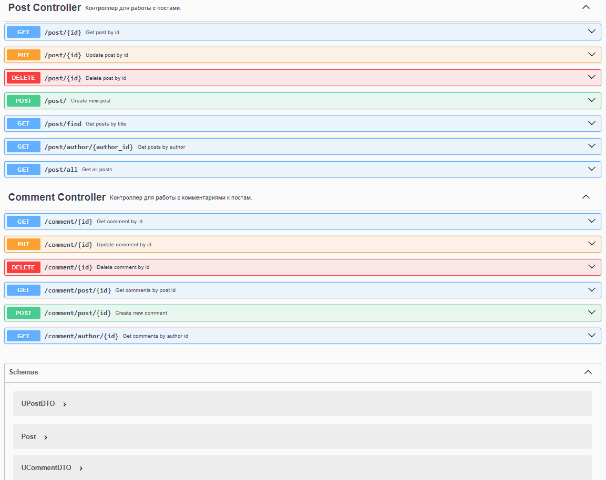

# Post Management Service (Post_MS-X3)
Микросервис для управления пользователями учетными записями пользователей и их подписками.


## Содержание
- [Особености](#особенности)
- [Технологический стек](#технологический-стек)
- [Требования](#требования)
- [Установка и запуск](#установка-и-запуск)
- [API Endpoints](#api-endpoints)
- [Примеры запросов](#примеры-запросов)
- [Тестирование](#тестирование)
- [Структура проекта](#структура-проекта)

## Особенности
- Управление учетными записями пользователей
- Управление подписками между пользователями
- Валидация данных и обработка ошибок
- Контейнеризация с Docker
- Интеграция с базой данных PostgreSQL
- OpenAPI документация

## Технологический стек
- **Язык**: Java 23
- **Фреймворк**: Spring Boot 3.4
- **База данных**: MongoDB
- **Библиотеки**:
    - Spring Data Mongo
    - Mongock
- **Инструменты**:
    - Docker
    - Maven
    - OpenAPI 3.0

## Требования
- Java 23+
- Maven 3.8+
- Docker 20.10+
- MongoDB 8.0+

## Установка и запуск

### 1. Клонирование репозитория
```bash
git clone https://github.com/ender019/Post_MS-X3.git
cd User_MS-X3
```
### 2. Запуск с Docker
```bash
docker-compose build --no-cache && docker-compose up -d
```

## API Endpoints
Документация доступна после запуска: ```/post/swagger-ui.html```

### Основные методы:


## Примеры запросов
### Добавление поста
```bash
curl -X POST http://localhost:8081/post/ \
  -H "Content-Type: application/json" \
  -d '{
    "title": "Sensation",
    "content": "Sensation content!!!",
    "author": "123"
  }'
```

### Получение постов по названию
```bash
curl -X GET http://localhost:8081/post/find?title=find
```
### Получение комментариев к посту
```bash
curl -X GET http://localhost:8081/comments/post/id-2344456437
```

## Тестирование
### Тестовое покрытие:

- #### Unit-тесты: сервисы, мапперы
- #### Интеграционные тесты: контроллеры, сервисы

### Запуск тестов

```bash
mvn test
```

## Структура проекта
```
src/
└── main/
    ├── java/
    │   ├── com/
    │   │   └── unknown/
    │   │       └── post/
    │   │           ├── advices/      # Глобальный контроллер обработки ошибок
    │   │           ├── changelogs/   # Миграции Mongock
    │   │           ├── configs/      # Конфигурации
    │   │           ├── controllers/  # REST контроллеры
    │   │           ├── dtos/         # Data Transfer Objects
    │   │           ├── entities/     # Сущности БД
    │   │           ├── repositories/ # Интерфейсы JPA
    │   │           └── services/     # Бизнес-логика
    │   └── resources/                # Конфиги и логи
    └── test/                         # Тесты
```
